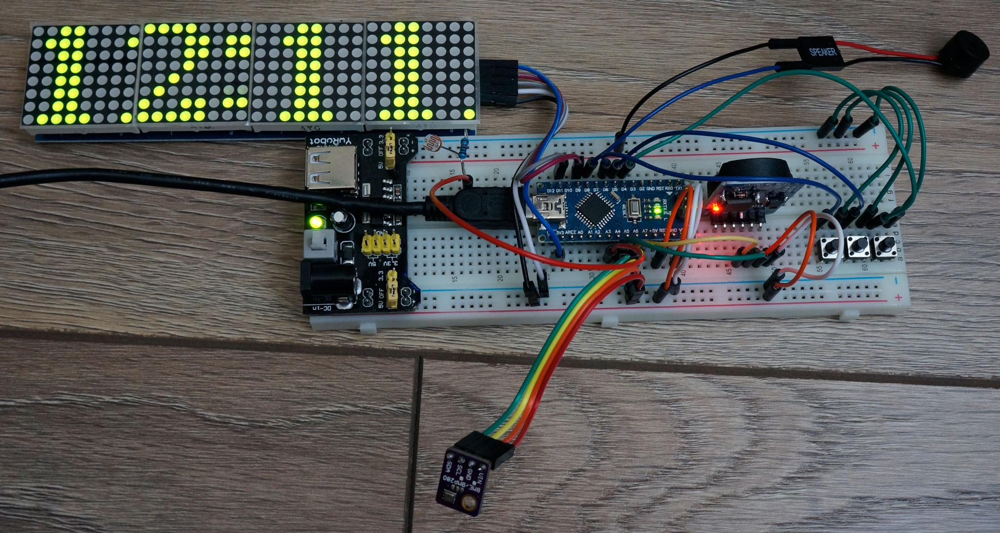
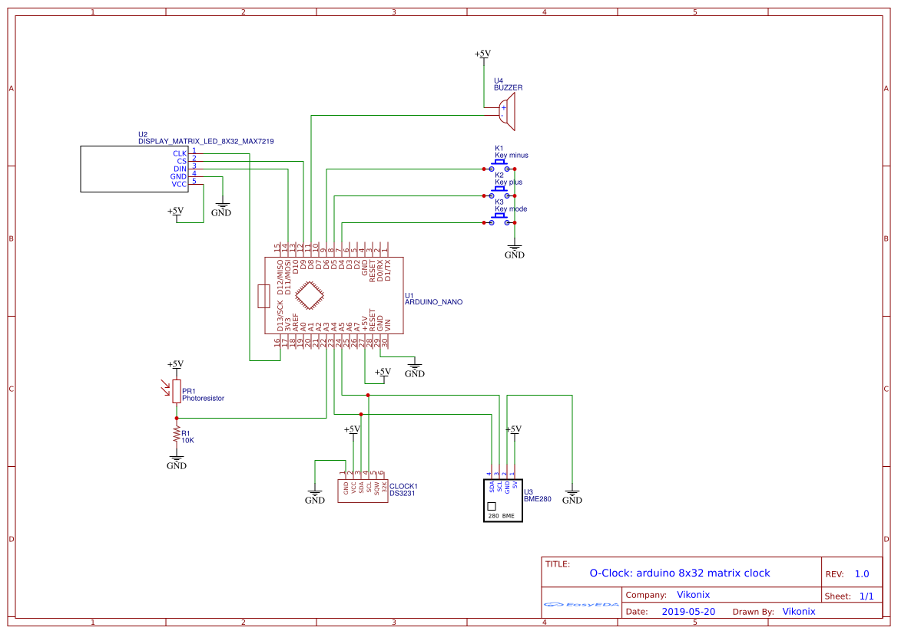

# O-Clock
Arduino Simple LED Matrix 8x32 Alarm Clock.

It's clock with big animated digits.
For alarm signal selected melody is playing.
Alarm can be armed for specified days of week.
Clock can show temperature, humidity and date.

 - Tested with Arduino Nano v3.0
 - Screen - 8x32 led matrix (SPI)
 - Time - rtc DS3231 (I2C)
 - Sensor - BME280 (I2C) (Optional)
 - 3 keys ('+', '-', 'Mode') ('-' optional)
 - Brights adjustment with photoresistor (5528 Light Dependent Resistor LDR 5MM)
 - Passive piezo buzzer for melody playing

If you have digital noise in buzzer especially on high bright level you need to add electrolytic capacitor about 470 mkF and ceramic 0,1 mkF at the power line.

If you not have temperature and humidity indication with BME280 sensor check it's address. In code the address is specified for China module (0x76 in clock.cpp:81).

Project can be compiled in Arduino IDE or in PlatformIO

External libraries:
 - LEDMatrixDriver
 - RTClib
 - EEPROM
 - NonBlockingRTTTL
 - Bounce2
 - Adafruit Unified Sensor
 - Adafruit BME280 Library

Breadboard photo
 

Schematic
 
 
---
Version 1.1 - stable version.

You can see how this clock works on [YouTube](https://www.youtube.com/watch?v=Dx4R_fJPpwI).

You can see PCB layout on [EasyEDA](https://easyeda.com/vikonix/o-clock).
 
External libraries Dependency Graph:
- LEDMatrixDriver 0.2.2
   - SPI 1.0
- RTClib 1.14.0
   - Wire 1.0
- NonBlockingRTTTL 1.3.0
- Bounce2 2.70.0
- Adafruit Unified Sensor 1.1.4
- Adafruit BME280 Library 2.2.1
   - Adafruit BusIO 1.9.1
   - Adafruit Unified Sensor 1.1.4
   - SPI 1.0
   - Wire 1.0
- EEPROM 2.0
